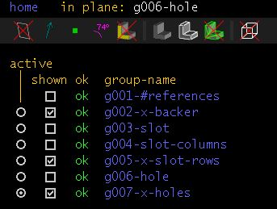

Product: Ball Storage, Slot Wall Accessary, June 2015

Designer: Eric Schleicher, erics@obrary.com

Support:  http://forums.obrary.com/category/designs/slot-wall

Distributed by:  Obrary, Inc.  http://obrary.com

Obrary - making it easy to make

## Notes
The Slot wall is an organization system like no other. It's unbelievably useful and draws comments and conversation whenever people see it.  Use it to create infinitely scaleable organized surfaces
#### Files

- keep the following two files together
 - ```slot-wall-hole.slvs``` The slot (see material thickness note to determine if you need to make adjustments)
 - ```slot-wall.slvs``` - The backer board 
 

####  Material Thickness
This wall was designed for 18mm birch plywood.  Materials selection can have a significant impact on the slot size, specifically the width of the slot.  Just For reference, the Birch plywood used for building our walls was 0.722".  if your materials is thicker you will need to compensate for the width of the slot (by editing the width constraint in the ```slot-wall-hole.slvs```. It's ok for this value to have a gap (~1/16") and will ensure that accessories fit in easily across all seasons.  One of the first walls was machined with very tight tolerances and is a little difficult to pull some accessories in and out depending on the season/humidity.

####  Finish
The backer design is intended to be cut with a 1/4" endmill.  If you have a downcut bit it's likely a good idea to use it. a compression bit might let you choose the front side based on the quality of the result...  It's certainly better if the bit is newer, or at least to have established the quality of edge finish with the chosen materials before you start.  if you end up with 75 or 150 holes that require manual finishing it can be very time consuming.

#### Sizing
the 4x4 wall is slight smaller to ensure that the board can be made square to your machine.  this means that in the X-axis there is .5 " of margin (.25 each side).  in the Y-axis there is slightly less.  **if you change these values, be aware that it will change the spacing of the slots.**

#### Verifying your spacing is critical! 
The slot wall is easy to make, but it unforgiving if you make mistake on spacing.
 
If you make this board and accessories to go along with it **make sure to verify the spacing between the vertical and horizontal slots!** before you machine *anything*.

If you modify the backer (by adding size, columns or rows you **MUST** do this If you change the size of the backer board.

**Exporting**
--
it's pretty straight forward to export to DXF with the following settings.  none of the paths collide and they can be easily separated onto different toolpaths layers.



### Example 4x4 wall [DXF](example_export_4x4_slot-wall.dxf)
